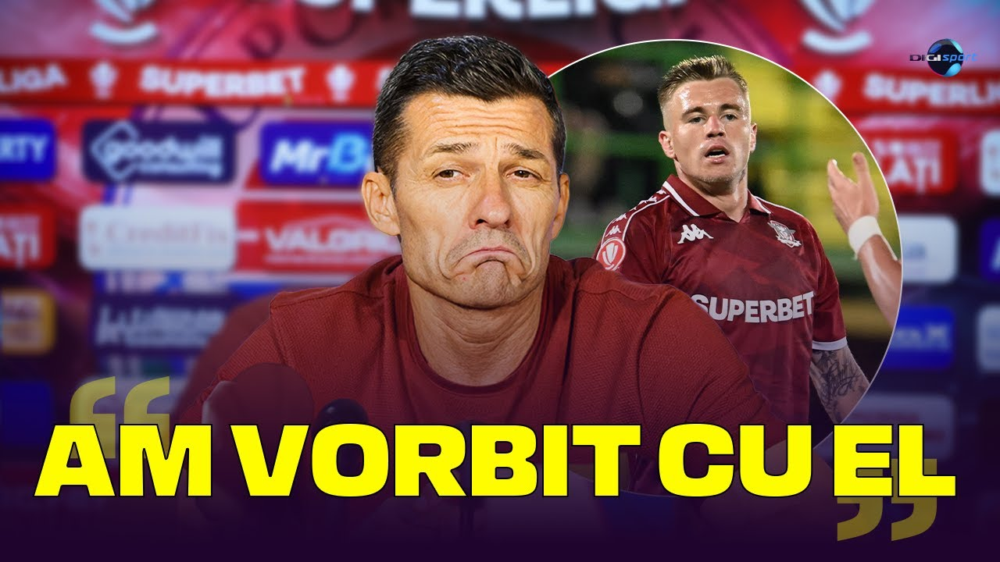

După meciul pierdut aseară de Rapid cu U Cluj (0-2), aproape toate reacțiile au vehiculat ideea că antrenorul ar fi principalul vinovat prin felul în care a gândit primul 11.

Concret, e vorba despre mutarea lui Dobre din dreapta atacului pe partea stângă, trecerea lui Moruțan în locul acestuia și scoaterea cu totul a lui Petrila din echipă.

Desigur, o bună parte din tot ceea ce auzi după meciuri în emisiuni sau din ceea ce citești prin textele de opinii reprezintă reacții emoționale sau exploatarea unor reacții emoționale.

Totul se-nvârte în jurul rezultatului nu doar pentru că “rezultatul este cel mai important”, ci și pentru că este cea mai facilă metodă de a stârni interes fără să faci vreun efort deosebit de analiză.

Dacă prin absurd, Rapid câștiga (să zicem că marca Christensen la acel șut), o bună parte dintre cei care acum susțin că Gâlcă a dat echipa peste cap prin mutările sale ar fi lăudat arta acestuia de-a gândi primul 11.

## De ce a pierdut de fapt Rapid aseară

Foarte pe scurt, Rapid nu a jucat aseară mai slab decât a făcut-o în unele dintre partidele pe care le-a terminat învingătoare sau măcar la egalitate de-a lungul acestui sezon.

Deci nu a fost ceva cauzat de faptul că Dobre a fost folosit în stânga sau că Petrila n-a fost titular. A fost ceva legat de **limitele echipei în ceea ce privește capacitatea sa de-a ataca pozițional** formații care știu să se apere bine și au la rândul lor suficientă calitate ca să se descurce cu mingea atunci când o câștigă - exact cazul lui U Cluj.

De altfel, acesta este motivul pentru care Gâlcă a tot cerut acel mijlocaș ofensiv, dar și un atacant central  - pentru că ce avea era insuficient ca să rezolve această hibă din jocul giuleștenilor. 

A, ok, a venit Moruțan, dar dacă ai un pic de înțelegere a fotbalului, evident că asta nu va rezolva toate problemele cronice ale jocului Rapidului. Normal, se cunoaște venirea acestuia - în două jocuri a dat mai multe pase luminoase decât a strâns echipa în 10 partide anterior venirii sale.

Dar nu e suficient. 

Apoi, Paraschiv joacă mai ales pentru că face și ceea ce Kolijc nu are cum să facă - prin efort și prin poziționare ajută enorm echipa pe fază defensivă. Da, știu, e atacant, rolul său e să dea goluri. Poate va da, habar n-am, dar efortul pe care-l face este suficient de folositor echipei în opinia lui Gâlcă cât să-l bage în fața bosniacului. 

În rest, Gâlcă mai are și scuza obiectivă că i-au lipsti 3 oameni din defensivă, toți 3 în formă foarte bună (Manea) sau măcar bună (Kramer și Pașcanu).

## De ce e aberant să crezi că Dobre în stânga e vreo crimă tactică

Înțeleg că până să vină la Rapid, Dobre a jucat în special în stânga. Normal, dacă în ultima vreme a evoluat mai ales în dreapta, e firesc să aibă acum repere mai bune în această parte.

Dar de aici și până a avea impresia că a juca în poziția în care a jucat aproape toată cariera sa de la seniori reprezintă o mutare dezastruoasă mi se pare prea mult.

De altfel, Dobre n-a avut absolut nicio problemă ca din postura de aripă stânga să marcheze un gol de-a dreptul spectaculos la Galați.

Deci problema majoră nu este că Dobre a jucat în stânga, problema majoră este că acesta se află de ceva vreme într-o pasă mai puțin fericită în ceea ce privește jocul său general. 

Nu e într-o formă deosebită indiferent că joacă în dreapta sau în stânga. 

## De ce a fost scos Petrila din primul 11

Cel mai probabil, Petrila a ieșit din echipă la acest joc nu doar pentru că Gâlcă a vrut să-l titularizeze pe Moruțan în disperarea sa de-a rezolva blocajul echipei pe atac pozițional, dar și pentru că Grameni a jucat foarte bine atât în pregătiri, cât și în cele două etape de la reluarea campionatului.

Cu Grameni în formă, cu Christensen probabil foarte important în ceea ce privește modul în care Gâlcă vede jocul Rapidului și cu Moruțan care a arătat că ajută mult echipa ofensiv și care are în mod real o preferință pentru marginea din dreapta, decizia a fost să iasă Petrila din echipă la acest meci.

Care Petrila are la rândul său o problemă în ceea ce privește forma, dar și probleme punctuale când are în față adversari care-i pot contracara principala calitate - viteza (gen Friday Adams, de la Botoșani).

În fine, aș vrea să speculez ceva bazat pe percepția mea, nu pe vreo informație concretă - impresia mea este că Gâlcă nu e super încântat în general de Petrila. De altfel, la un moment dat, cineva conectat la lumea impresarilor îmi spunea că și conducerea ar fi vrut să-l vândă de ceva vreme și că inclusiv venirea lui Drilon Hazrollaj era cumva gândită pentru niște permutări care să-l facă înlocuibil pe Petrila.

Repet, nu am nicio informație concretă, este doar o speculație. Așa cum speculație este și ideea mea că până la finalul acestei perioade de transferuri, unul dintre Petrila și Dobre va fi vândut.
