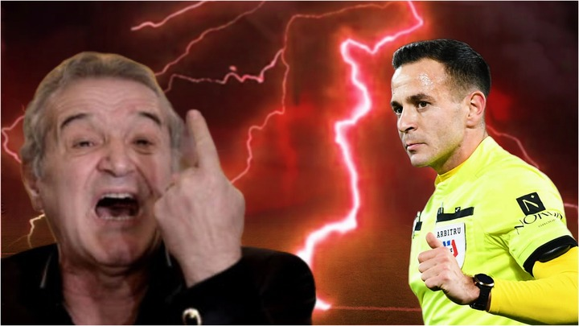

 Foto: Fanatik

După victoria de la Sibiu (3-0), Rapid a făcut din nou o eroare majoră legată de tema pe care nu reușește să o impună suficient de solid în spațiul public - faptul că sunt super dezavantajați de arbitraje. 

Pentru Victor Angelescu, principalul om de comunicare al Rapidului, orice victorie este un prilej să fie politicos și logic. Adică, admirabil din perspectiva caracterului, total neprofitabil din perspectiva intereselor clubului. 

După părerea mea, elementul central al comunicării de după acest meci, strict în condițiile a ceea ce au trăit ei în acest sezon, ar fi trebuit să fi fost legat de arbitraj:

> “Uitați ce se întâmplă când nu suntem dezavantajați clar sau măcar tocați mărunt de arbitri. Astăzi am avut parte de un arbitraj normal și echipa a putut să-și vadă doar de fotbal. Și s-a cunoscut în joc și pe tabelă. 

> Din păcate, deși un astfel de arbitraj este absolut normal, noi nu am putut să beneficiem de această normalitate decât extrem de rar de-a lungul întregului campionat.

> Mă uit cu invidie la cum sunt tratate rivalele noastre și mă întreb de ce este atât de dificil pentru CCA să asigure condiții normale pentru toți, mai ales că există și sistemul VAR acum”.

## De ce ar trebui Rapid să vorbească de arbitraje în condițiile unui arbitraj foarte bun al lui Flueran

Arbitrajul este tema pe care cei de la Rapid ar trebui să o exploateze pentru că au argumente solide să o facă și pentru că este zona care poate face diferența în ierarhia finală.

Dincolo de faptul că Rapid nu a primit în acest sezon 7 lovituri clare de  la 11 metri (din cele 12 solicitate de ei), în timp ce FCSB avea deja 10 penalty-uri acordate în primele 14 etape, echipa lui Gâlcă a avut parte de o grămadă de meciuri în care arbitrii i-au batjocorit la nivel de decizii mărunte, exact ca cele care l-au făcut pe Becali să-și iasă din minți la partida cu Csikszereda.

Amuzant este că asta li s-a întâmplat mai ales la meciurile de acasă, unde faulturi imaginare date adversarului, cornere clare refuzate și altele de gen i-au scos din situații favorabile pe giuleșteni.

Situații care, în condițiile unui joc cu mari probleme în ceea ce privește atacul pozițional, ar fi fost aur pentru echipa lui Gâlcă.

Dar dincolo de argumentele solide despre care vorbesc, cei de la Rapid ar fi trebuit să înțeleagă un lucru simplu - comunicarea unui club nu se rezumă doar la realitate, ci trebuie să includă toate interesele sale. 

Asta implică depășirea realității?

Asta implică minciună sau manipulare?

Nici pe departe.

Asta implică prezentarea realității de o manieră avantajoasă. 

Ceea ce e foarte ușor la Rapid în condițiile în care realitatea spune deja că ei au fost călcați în picioare de arbitraje de o manieră pe care eu n-am văzut absolut niciodată în condițiile în care văd toate meciurile din Liga 1 de decenii bune.

Am mai repetat, nici măcar Craiova lui Mititelu, în cei doi ani consecutivi care au precedat prima retrogradare din istoria clubului nu a pățit așa ceva cel puțin când vine vorba de penalty-uri neacordate. Și pe atunci, nu exista VAR, ceea ce face și mai gravă situația actuală a celor de la Rapid.

## Când FCSB a fost înghesuită de un arbitru, Becali a făcut ca RO Alert-ul

Cei de la Rapid ar trebui să se uite la cum reacționează cei de la FCSB când vine vorba de arbitraje. După cum ți-am mai spus, în mod natural, FCSB este echipa care are parte per total de cele mai favorabile arbitraje din fotbalul nostru.

Dacă nu ai citit deja ce-nseamnă “arbitraje favorabile în mod natural”, [te rog să citești ca să înțelegi](https://iamsport.ro/editorial/de-ce-fcsb-este-o-echipa-ajutata-in-mod-natural-de-arbitri-stefan-beldie-nu-se-fereste-comparatia-cu-rapid-la-lovituri-de-pedeapsa-e-cazul-absolut-extrem-id43836.html).

În fine, după ce FCSB a avut parte de un arbitraj mai mult decât neprietenos, chiar real dușmănos la meciul cu Miercurea Ciuc - adică decizii care îi țineau pe adversari peste ei mai ales prin acele lovituri libere date aiurea în preajma careului - Becali a vorbit de acte criminale împotriva sa. 

Și-n cazul său, chair se poate vorbi de moarte în direct pentru că, Doamne ferește, dacă dânsului i se întâmplă ceva rău ca urmare a faptului că-l fură un arbitru, incidentul clinic are toate șansele să se producă în timp ce se află în direct la TV.

Tu-ți dai seama?

Pentru niște decizii clar greșite, dar care n-au gravitatea neacordării a 7 penalty-uri evidente așa cum s-a li s-a întâmplat în acest sezon celor de la Rapid, Becali și, ulterior, Mihai Stoica, au avut grijă să țină toate emisiunile posibile la curent cu drama lor.

Asta în condițiile în care acel arbitru care s-a făcut de râs are măcar două scuze - că ningea și asta poate că a scos și mai mult în evidență instinctul său slab pe care s-a bazat când lua acele decizii și că nu putea fi ajutat de VAR, fiind vorba de faulturi în afara suprafeței de pedeapsă nesancționabile cu cartonaș roșu.

## De ce a câștigat Rapid la Sibiu 

După cum probabil ai văzut deja, există tot felul de explicații legate de succesul giuleștenilor la Sibiu (3-0).

Cea mai evidentă / solidă este că de data asta, Gâlcă a făcut echipa cum trebuie, iar în secundar, echipa lui Dorinel Munteanu a fost slabă spre deplorabilă în unele momente.

Corect, dar aș mai adăuga măcar un element pe care nu-l vei vedea menționat absolut nicăieri tocmai pentru că cei de la Rapid nu l-au evidențiat - arbitrajul a fost cum n-au visat sezonul acesta că poate fi - adică, fără eroare împotriva lor. 

Deci nu că i-a favorizat, ci pur și simplu, nu le-a mai luat din ceea ce era firesc să primească.

În condițiile acestea, bunul simț te-ndeamnă să fii mulțumit și să nu mai reclami prejudicii trecute. Doar că bunul simț după care Angelescu se ghidează în toate ieșirile sale publice este un reper de care prea puțini țin cont în fotbal.

Omul este mereu de un fair play incredibil în toate aparițiile sale, dar de la un punct încolo, asta îi face pe Rapid să devină blegi în loc de credibili. 

Teoria mea este că dincolo de felul de-a fi a lui Angelescu, acolo este un complex legat de faptul că Rapid a avut o grămadă de meciuri sezonul acesta în care a jucat slab sau prost de-a dreptul și totuși a adunat puncte. 

Iar dintr-un soi de rușine, Angelescu nu are curajul să strige cum strigă, în ordinea gălăgiei, FCSB, Craiova și Dinamo atunci când sunt lezate.