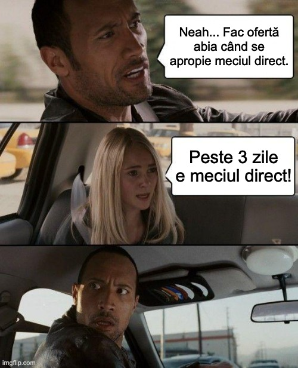

În ultimii ani, am constatat suporterii sau colegii mei de breaslă folosesc un pic haotic sintagamele care descriu meciurile dubioase din Liga 1. 

Prin urmare, pentru ca lucrurile să fie prezentate cu maximă acuratețe, vreau să ofer reperele corecte în ceea ce privește acești termeni și să introduc unele noi  în Dicționarul Explicativ al Meciurilor Dubioase (DEMD) 

Prin urmare, lucrurile stau așa:

**Blat** - înțelegere între două echipe pe baza relațiilor de prietenie între conducătorii acestora. De obicei, este vorba de conducători pe stil vechi, care au abilitatea de-a vorbi cu cine trebuie din propria echipă și de-a elimina din discuții fotbaliști incapabili să onoreze așa cum trebuie evenimentul. Blatul este negat cu înverșunare când se petrece, dar este povestit peste ani cu maxim amuzament. 

**Bârsănire** - sintagmă inventată de mine sub influența lui Sorin Cârți pentru a explica situația în care un arbitru ajută o echipă oarecare, să zicem FCSB, să scape de emoțiile unui meci dificil prin decizile sale aiuritoare. Unii îi mai spun și Costreiere sau Popire, dacă rezolvarea vine de la VAR. Îmi permit să fac jocuri de cuvinte cu numele oamenilor doar pentru că mă cheamă Beldie, altfel, aș fi fost mult mai corect politic în această privință.

**Black Friday** - sintagmă lansată de mine ca să explic situațiile în care domnul Becali dorește un jucător de la echipa adversă fix înaintea meciului direct.Exemplele sunt numeroase, dar mă rezum la cum l-a ofertat pe Baba Alhassan chiar înaintea unui meci cu Sibiul și cum cei de la Sibiu nu l-au mai folosit pe băiat apoi contra campioanei pentru că era tulburat de oferta în cauză. Uneori însă, Becali pune jucătorul în coș, dar nu finalizează tranzacția. Sau  chiar returnează produsul.

**Gospodărire** - sintagmă lansată de mine care implică oferte făcute din timp, nu în buza meciurilor. Astfel, un patron, nu doar domnul Becali, demonstrează spirit gospodăresc și se asigură că unii jucători nu vor mai apuca să joace împotriva sa sau echipele de la care-i cumpără vor slăbi și vor avea dificultăți să se mențină în fața FCSB. Gospodărirea este real onorabilă spre deosebire de Black Friday.

**Meci suedez** - sintagmă lansată de mine pentru a prezenta situațiile în care o echipă suferă de sindromul Stockholm în relație cu adverarsul. La vedere, pare o acțiune pragmatică care însă  duce la ușurare misiunii adversarului să câștige jocul direct. Ia cazul în care Botoșani se prezenta la un meci din Cupa României cu FCSB fără titulari. Iar Iftime, îmi plângea în emisiune că Grozavu nu înțelege gloria competiției. Sau ia exemplul echipelor mici care-și cedează dreptul de-a organiza pe teren propriu partidele din Cupa României - ex. Afumați și Dumbrăvița cu Rapid sau Craiova cu Sănătatea Cluj.

**Omenie**  - sintagmă lansată de Gigi Becali ca să explice de ce i-a dat meciul lui Hagi când acesta avea nevoie să se salveze de la retrogradare (Steaua - Viitorul 2-5). Omenia implică să dai un meci fără ca adversarul să-ți ceară asta. Pur și simplu, așa ești tu, mai omenos și mai lipsit de interese ulterioare.

**Slujire** - sintagmă lansată de mine ca să explice situațiile în care o echipă ajunge să aibă statut de vasal în relație cu o altă echipă. A face slujire înseamnă să oferi stăpânului ce așteaptă acesta de la tine și chiar să-i întreci uneori așteptările prin multitudinea de oportunități pe care i le oferi ca să câștige meciul direct. Desigur, a face cu adevărat slujire implică să fii în același timp nemilos cu dușmanii stăpânului tău. Uneori, apar situații dramatice în care slujitorii nu se dovedesc ceea ce păreau să fie - ex. Romeo Bunică sau finul Pandele.

**Tudorism** -  act de retragere de arbitraj și alipire la clubul pe care l-a slujit cu credință în timpul activității. Acțiunea este explicată oficial mai ales prin faptul că arbitrii au genul de instruire care le permite ulterior să fie de mare ajutor cluburilor pentru că știu regulamentul, știu limbi străine, știu să relaționeze cu instituțiile din fotbal etc. 