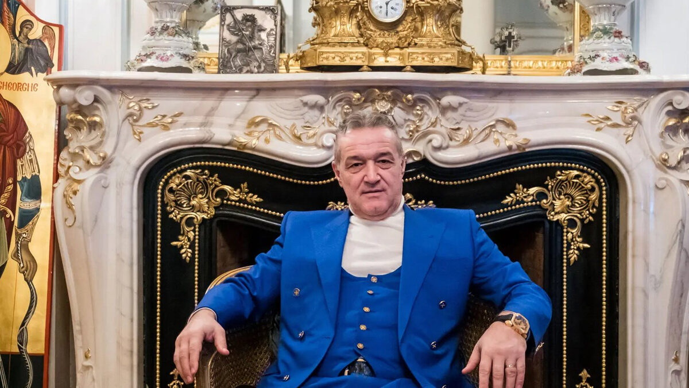

După ce Radu Petrescu a comis-o aseară spectaculos-penibil la meciul Petrolul - FC Argeș, o grămadă de voci s-au îngrămădit firesc să acuze o nouă conspirație menită să aducă pe FCSB în play off.

Suporterii rivalelor insistă asupra faptului că FCSB s-ar asigura că lucrurile se petrec în favoarea sa inclusiv cu prețul unor grozăvii în ceea ce privește arbitrajul.

Cei mai sofisticați în ceea ce privește urmărirea informațiilor legate de Liga 1 merg cu acuzele spre Orlando Nicoară, șeful companiei care deține drepturile TV ale campionatului nostru și le vinde televiziunilor.

Totul alimentat de o declarație a acestuia din care ar reieși dorința acestuia ca echipa lui Becali să ajungă în play off din rațiuni evidente - un interes mai mare pentru competiție, deci o audiență mai bună a meciurilor.

În ciuda eforturilor mele, **nu reușesc să găsesc această declarație**, dar văd atât de multe referiri la o astfel de poziție din partea lui Nicoară încât îmi imaginez că spus ceva care măcar poate fi interpretat în această direcție.

Voi încerca să găsesc și voi reveni aici cu detalii când / dacă reușesc.

## Ce cred eu că a făcut Radu Petrescu aseară

[Așa cum am spus și imediat după meci](https://www.facebook.com/stefan.beldie/posts/pfbid0uoyAP2a1B779mgdbcbDiBM1hcTxnUXTFXkCaYqUxYg6C45bjau39Uuyjdp5BqvjSl), părerea mea este că Petrescu nu a încercat să execute un ordin prin care să o dezavantajeze pe FC Argeș cu scopul de a o avantaja pe FCSB. 

Cred că unul dintre arbitrii asistenți care au avut comunicare cu el - tușierul de pe partea pe care s-a produs faultul acela imaginar asupra lui Oancea, arbitrul de rezervă sau arbitrul VAR - i-a spus în cască faptul că decizia sa a fost greșită, că n-a fost fault.

Dintre toți, arbitrul VAR nu are voie să-i transmită astfel de informnații, dar există credința alimentată de oameni din fotbal că totuși arbitrii se mai ajută unii pe alții prin comunicări codate.

Speculez că arbitrul VAR, Iulian Dima, este cel care l-a anunțat pe Petrescu pentru că e singurul care a avut acces la reluări și putea să vadă astfel evidența că Oancea nu fusese faultat.

În fine, cred că Petrescu a decis în urma acestei informații să facă în așa fel încât FC Argeș să nu beneficieze de respectiva lovitură liberă și, imediat ce s-a executat, a fluierat ceea ce s-a vrut a fi un fault în atac.

Mingea trimisă de Micovschi și-a parcurs traiectoria, a ajuns la Sierra și spaniolul a marcat. 

Adică, a produs ceea ce a transformat decizia lui Petrescu într-un dezastru absolut.

## De ce nu e aberant ca oamenii să facă tot felul de scenarii legat de ce s-a întâmplat

Faptul că eu sunt în mare măsură convins că lucrurile s-au petrecut așa cum le-am menționat mai sus nu înseamnă că automat cred orbește în această variantă.

Este doar varianta care mi se pare mie cel mai probabilă.

Prin urmare, deși cred că e incorect să spui că Radu Petrescu a furat-o pe FC Argeș ca s-o bage pe FCSB în play-off, cred că este sănătos să ai suspiciuni în orice direcție posibilă, deci și-n direcția FCSB sau Nicoară sau oricine ar putea fi interesat în povestea aceasta.

Inclusiv în direcția CFR Cluj, echipă care la rândul său încearcă să ajungă în play-off și care are un istoric în ceea ce privește deciziile aiuritoare ale lui Radu Petrescu - vezi cazul Beto, când a anulat un gol regulamentar Voinței Sibiu pentru un fault imaginar asupra portarului portughez care apăra la CFR Cluj.

Sau, pentru cei cu mare ținere de minte, ignorarea de către Petrescu a unui fault violent al lui Culio (?) asupra unui fotbalist de la Sportul Studențesc. Faultul se produce sub privirile lui Radu Petrescu, la câțiva metri de el, iar filmarea îl arăta pe acesta că întoarce capul după ce se produce ca și când acolo n-a fost nimic. 

Normal, logica suspiciunilor te face să să faci și o ierarhie a suspecților, de aici și reflexul multora de-a vorbi de FCSB într-o situație în care campioana nu are la modul direct nicio implicare, ci doar imaginea de echipă mare care își rezolvă problemele și-n afara terenului.

## Nicoară ar piede mai mult din alterarea imaginii competiției decât dintr-o eventuală neparticipare a FCSB în play-off

Dacă ai ajuns cu cititul până aici, există o șansă importantă să nu faci parte din categoria celor care urmăresc ce spune cineva doar dacă acel cineva le confirmă ceea ce cred ei deja despre un subiect.

Deci ai capacitatea să iei în calcul posibilitatea aceasta nespectaculoasă în care Petrescu a fost pur și simplu un bleg absolut, care a vrut să salveze o decizie greșită cu ajutorul unei decizii care s-a dovedit ulterior catastrofală.

Adică, ceva ce instructorii arbitrilor insistă să nu faci tocmai pentru că efectele pot scăpa de sub orice control - “nu fluiera în compensare dacă ai comis deja o eroare”. 

Luna trecută, [am scris despre cât de nocivă ar fi](https://iamsport.ro/editorial/fcsb-impinsa-cu-forta-in-play-off-ar-fi-o-operatiune-tare-scumpa-stefan-beldie-nu-crede-ca-ros-albastrii-vor-fi-ajutati-sa-prinda-top-6-exista-aceasta-probabilitate-id45463.html) o eventuală acțiune de împingere a FCSB în play off cu prețul alterării imaginii competiției.

Și am insistat asupra ideii că deși deținătorul de drepturi, eAD, ar avea de câștigat de pe urma unui play-off cu FCSB printre cele 6 calificate, dacă aceasta intră de-o manieră rușinoasă, compania condusă de Orlando Nicoară ar pierde probabil major pe termen mediu și lung. 

Interesul logic al eAD este ca Liga 1 să aibă o imagine bună, oamenii să fie atrași de competiție, astfel încât televiziunile să cumpere drepturile în continuare. 

Singurul scenariu simplist în care eAD ar fi dezinteresată de pagubele de imagine ale competiției este unul în care compania  își finalizează contractul în curs și nu mai intenționează să participe la următorul ciclu de vânzare a drepturilor.

Iarăși, tot la capitolul de forțări de logică ar fi scenariul în care eAD ar avea interesul chiar ca Liga 1 să fie jos la nivel de  imagine astfel încât următoarea achiziție a drepturilor să se facă la un preț convenabil, nu la unul zdravăn crescut, cum intenționează cluburile să obțină. 

Deși e sănătos să iei în calcul orice variantă, părerea mea este că idealul pentru eAD ar fi ca Liga 1 să aibă o imagine excelentă, adică să atragă publicul, iar drepturile să fie la ei pentru vânzarea mai departe către televiziuni.

Prin urmare, deși l-ai auzit doar pe Dani Coman urlând și pe primarul Piteștiului arătându-se dezolat justificat de ce s-a întâmplat aseară, această lovitură de imagine pentru Liga 1 e posibil să fi produs indirect cea mai mare pierdere financiară chiar pentru compania condusă de Nicoară.

## Cum îți dai seama dacă ești lucid sau doar visezi răzbunări în cazul unor scandaluri de acest gen

Ca suporter al unei echipe, e posibil să urăști voluntar o serie de echipe rivale. 

Și mai e posibil ca această ură să ducă la situații în care să refuzi realitatea doar de dragul confirmării că ura ta este justificată.

De exemplu, dacă ții cu Dinamo, dar orice succes din Europa a FCSB ți se pare ceva lipsit de importanță, exagerat de presa românească, există riscul să nu fii capabil să privești obiectiv realitatea.

La fel, dacă ții cu FCSB, dar ți se pare că tot ce se strofoacă să facă cei de la Rapid pentru a avea un club modern este penibil, e posibil să ții orbește cu echipa ta și să nu sesizezi ce vulnerabilități are tocmai din cauza faptului că nu fac nimic aproape din penibilul pe care-l fac cei de la Rapid.

Și exemplele pot continua.

O grămadă de oameni trăiesc așa când vine vorba de fotbal, de politică sau de orice alt domeniu care trezește pasiuni intense. 

Dar faptul că mulți fac asta nu înseamnă că e ceva normal.

E la fel de penibil și dacă o face un om, și dacă o fac milioane. 

Orice îndepărtare de dorința de-a fi logic, de-a fi lucid, te reduce ca om tocmai pentru că umanitatea nu înseamnă emoții orbești, ci mai ales rațiune. 

Poate că la un moment dat, povestea de aseară se va dovedi o schemă sinistră a lui Becali. Mă îndoiesc, dar adevărul este că habar n-am ce va fi.

Totuși, te asigur că nu vei pierde nimic dacă până când se va dovedi asta, îți vei rezerva măcar parțial manifestările de revoltă pentru acel moment.

Și să redirecționezi parțial acea energie nervoasă pentru...

Glumesc, e treaba ta ce faci.

Dar nu vei pierde ceva dacă ceea ce faci e însoțit și de logică.