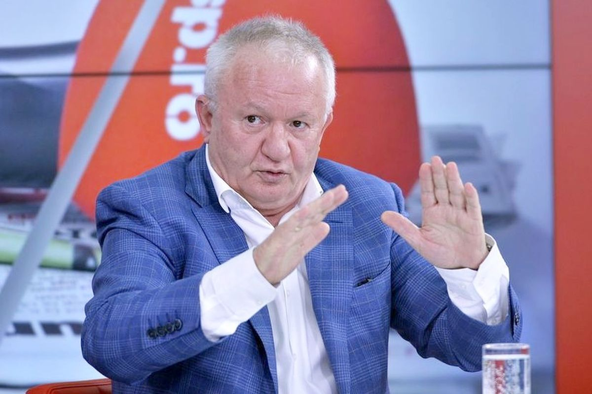

Am scris zilele trecute despre [mișcarea strategică a lui Mihai Stoica](https://www.facebook.com/stefan.beldie/posts/pfbid02qVz9fu5ihmEXHJpkP68zh7eT8FXHRkbuvdR9VYi684Mry69PtB7NSqyNm42iXduJl) prin care a încercat încă o dată să îngusteze “sursa de adevăr” când vine vorba de FCSB.

În emisiunea de la Prima Sport, Stoica a insistat că nu are încredere în nimeni când vine vorba analizarea arbitrajelor și că experții în arbitraj sau cei care comentează prin emisiuni fazele nu sunt obiectivi pentru că ori au simpatii care-i fac să antipatizeze FCSB, ori vor să lovească în FCSB pentru că-l invidiază pe Becali. 

Adică un fel de "nu credeți pe nimeni, doar eu și Gigi nu vrem răul FCSB".

Discursul său a fost ca întotdeauna unul deștept - nu poate cineva să-i reproșeze că nu are încredere în diverși, nu te poți pune cu ce simte un om. Plus că e dreptul lui să-și distribuie încrederea exact cum dorește.

Mai mult, Stoica a făcut apel la un argument pe care nimeni nu-l poate contesta - orice om sănătos psihic are un anume grad de subiectivitate în relație cu absolut orice.

## Abilitatea lui Stoica de-a spune adevăruri absurde

Desigur, simplu fapt că ceva e adevărat nu înseamnă automat că nu poate fi absurd în context - de exemplu, dacă spui că vinzi băutură îndulcită cu miere de albine și la analiză se constată că băutura respectivă conține miere de albine, ai spus un adevăr.

Doar că pentru logica consumatorului are importanță și ce cantitate de miere de albine ai adăugat. Că dacă pui un gram de miere la 100 litri de băutură, respecți adevărul fizic, dar ți-ai bătut joc de client, care se așteaptă ca mierea adăugată să fie suficientă cât să conteze.

Așa e și cu cei care comentează arbitrajele, inclusiv cele care o vizează pe FCSB - toți sunt oameni, deci toți sunt subiectivi, dar tot prin natura umană este evident că măcar o parte își dau silința să fie obiectivi, adică să analizeze lucrurile corect.

Stoica încearcă să convingă publicurile sale că acești oameni nu ar exista de fapt. 

Asta deși în experiența umană apropo de analiza fazelor de arbitraj tocmai asta se-ntâmpla - unii dintre experți, unii dintre ziariști, unii dintre analiști, unii dintre oamenii de fotbal etc. comentează cu onestitate ceea ce văd.

Verdictele lor pot fi corecte sau nu, dar categoric o parte dintre ei au onoare și o folosesc.  

Ar trebui să ai probleme de logică și de contact cu realitatea vieții ca să crezi că toți cei care își dau cu părerea la TV au ceva cu FCSB sau îl invidiază pe Becali, așa cum încearcă interesat Stoica să te convingă.

## Ce spune Adrian Porumboiu despre încercarea lui Stoica de-a-l decridibiliza

În contextul declarațiilor lui Mihai Stoica, postării mele de pe Facebook și comentariilor fanilor legate de obiectivitatea experților în arbitraj, am fost azi sunat de Adrian Porumboiu.

Cu care am o relație apropiată, în sensul că nu trec mai mult de 15 ani între discuțiile noastre telefonice. 

Și Adrian Porumboiu a zis în stilul său următoarele:
 
> **“Mihai Stoica m-a cunoscut pe mine pe când eu eram arbitru, iar eu l-am cunoscut pe când dânsul era paharnic la protocoalele de dinaintea meciurilor de la Galați.**

> **Deci el știe care a fost nivelul meu profesional, cum am fost eu ca arbitru, care a fost nivelul meu de moralitate. La fel, și eu pot să confirm că profesional Mihai Stoica era un paharnic bun, chiar nu-i pot reproșa ceva.**

> **Ce m-a deranjat și mereu mă va deranja este că eu am fost un arbitru de înalt nivel în niște vremuri în care statul și ministerele de forță nenoroceau vieți, iar eu am trecut prin asta demn, fără ca cineva să poată spune vreodată că am fost altfel decât corect. Nu accept ca cineva flexibil precum un vârf de undiță să-ncerce să pună la îndoială corectitudinea mea când vine vorba de arbitraj.**

> **De asemenea, simplu fapt că domnul Becali a primit 100 milioane Euro pe filiera ANRP sau că a luat Steaua cum a luat-o nu mă face să fiu invidios pe dânsul. E treaba dânsului, eu am treburile mele. Amândoi suntem la vârsta la care știm că importante în viață sunt familia, copiii, nepoții. Mă așteptam însă ca măcar el să nu-și lase angajații să vorbească de o asemenea manieră despre mine.**

> **Am observat chiar un soi de teamă în societatea asta fotbalistică și numai legată de Mihai Stoica și de Gigi Becali. Multora le este frică spună ceva ca nu cumva să-i supere și să ajungă în gura lor. Că-s răi de gură... Păi, eu am fost arbitru cu A mare și mi-am câștigat dreptul prin onestitatea mea profesională nu doar să comenteze situații de arbitraj, dar să am și curajul firesc de-a vorbi despre orice doresc.**

> **Nu am interese legate de fotbal, nu am nicio relație cu adversarele FCSB. Ce treabă să am eu, de exemplu, cu Mihai Rotaru de la Craiova?**

> **Din contră, la un moment dat am avut o dispută juridică, l-am și dat judecată”.**

**Notă**: pentru că n-am posibilitatea de-a-i oferi dreptul la replică lui Mihai Stoica, aș vrea să fac un comentariu legat de sintagma "paharnic" - în principiu, nu văd absolut nimic rău în a te comporta ca o gazdă la un protocol. 

Din contră, cred că dacă cineva te vizitează și ai ocazia să-i torni un pahar de vin, cred că-l onorezi și te onorezi ca gazdă, nu te umilești.

## Chiar reușesc Becali și Mihai Stoica să-i timoreze pe cei care-și dau cu părerea în emisiuni despre arbitraje? 

Remarca lui Adrian Porumboiu legată de faptul că Becali și Mihai Stoica au reușit prin discursuri agresive să-i inhibe pe cei care ajung să comenteze prin emisiuni ce se întâmplă în Liga 1 mi-a atras atenția în mod special.

Spun asta pentru că există o credință printre unii dintre fanii rivalelor FCSB că nimeni nu suflă vreo vorbă defavorabilă FCSB când apar controverse legate de arbitraj.

Adevărul este un pic nuanțat - cred că există unii invitați care, întradevăr, au tendința de-a fi “cuminți” în astfel de situații sub presiunea prezenței în studio a lui Mihai Stoica sau a intervențiilor telefonice ale lui Becali. 

Cred că majoritatea au această reținere din rațiuni obișnuit umane - pur și simplu, nu au o disponibilitate emoțională pentru conflict / dispute. 

Nu le place.

Nu se simt confortabil să intre în astfel de discuții cu oameni care ori au un talent real de-a purta astfel de dispute (Mihai Stoica), ori au o încredere nebună că dreptatea e de partea lor orice s-ar întâmpla (Gigi Becali).

Desigur, există și invitați care nu spun nimic sau o dau la pace pentru că preferă să-și slujească preferințele / simpatiile, nu contractul / meseria. Acest tip de invitat nu există doar pro FCSB, cam toate echipele mari beneficiază și de astfel de ajutoare.

Cel mai important însă, cred că majoritatea invitaților au o capacitate decentă de-a nu înghiți aberații și de-a-și exprima părerile pe baza a ceea ce percep și atât. 

Repet, majoritatea.

## Cine câștigă disputele legate de arbitraje are șanse să câștige arbitraje favorabile în meciuri

În ciuda a ceea ce declară diverși de prin fotbal, inclusiv arbitri - “eu nu mă uit la emisiuni, deci nu mă afectează ce se discută” - realitatea este că o parte din lupta pentru titlu se joacă și-n studiourile emisiunilor, și pe site-urile de sport.

Dacă reușești într-o emisiune să convingi audiența - publicul clasic + invitații (ziariști, analiști, experți etc.) că echipa ta a fost dezavantajată grosolan de arbitri sau că n-a fost avantajată când adversarii reclamă asta, poți avea influențe nebănuite asupra modului în care echipa ta va fi arbitrată.

Măcar unii dintre membrii CCA, arbitri, jucători, spectatori se uită la emisiuni și sunt influențați în diverse măsuri de mesaje convingătoare.

Atenție, am spus mesaje convingătoare, n-am spus neapărat mesaje logice sau argumentate. Uneori, convingător poate să fie  și ceva isteric, n-are importanță. Important este doar efectul.

De asta, pentru toate cluburile este o miză uriașă ca ceea ce se discută în emisiuni să ducă la propagarea unor mesaje favorabile lor către toți cei care pot ulterior să influențeze mersul lucrurilor inclusiv legat de arbitraj.

De altfel, nu-ți imagina că apariția la Prima Sport a trio-ului Sorin Cârțu, Victor Angelescu și Andrei Nicolescu ține doar de pasiunea lor pentru fotbal. 

Nu, cei în cauză se săturaseră ca pe frontul emisiunilor de analiză echipele lor să piardă constant disputa cu Becali și Stoica.