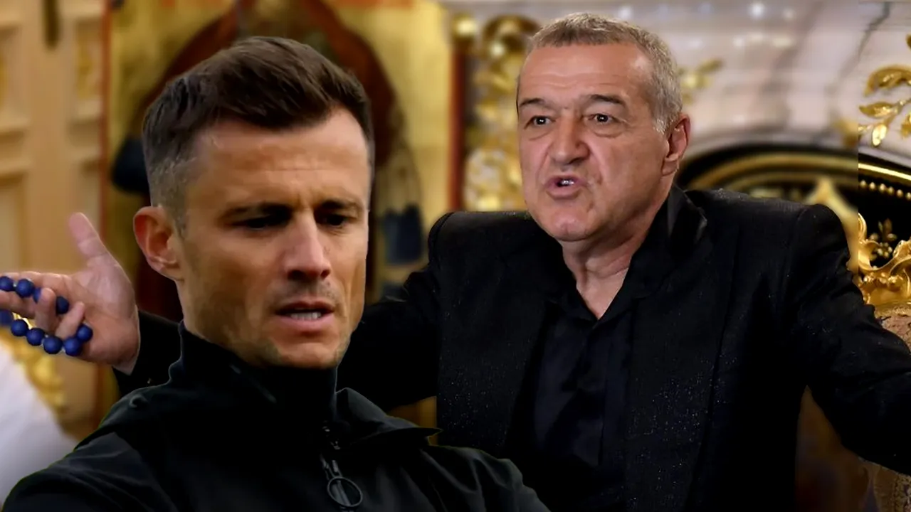

Teoria mea legată de succesul lui Becali în fotbal este destul de simplă - a riscat major doar când a preluat Steaua, iar apoi a aplicat destul de constant niște principii de prudență financiară țărănească. 

Pe scurt, totul ar putea fi însumat de zicerea sa:

> “Eu nu vreau să-mi fie frig la picioare, așa că mă-ntind cât îmi este plapuma”.

De-a lungul anilor, Becali s-a lăudat constant cu faptul că el, spre deosebire de toți cei care au investit în fotbal, a rezistat fără falimente sau insolvențe. 

Ce nu spune Becali este că el, spre deosebire de toți ceilalți, a luat Steaua, cea mai populară echipă din România, la o uriașă distanță de urmăritoare.

Acum, să nu înțelegi greșit.

Preluarea Stelei a fost un risc inițial uriaș pentru că nevoile financiare imediate ale acesteia erau unele demne să sufoce oameni de afaceri poate mai potenți financiar / politic decât era Becali acum 25 ani.

De exemplu, nu-ți imagina că frații Păunescu, cei de la care Becali a preluat controlul Stelei erau niște oarecare.

Din contră, Păuneștii au atins apogeul influenței lor exact în timpul regimului Iliescu / Năstase -  anii ’90 și începutul anilor 2000. 

Prin urmare, meritul inițial al lui Becali e de neconstestat din perspectiva capacității de-a rezista suficient cât să ducă echipa în postura de-a-ncepe să producă bani. 

Din acea clipă însă, Steaua / FCSB a fost continuu un club masiv subexploatat raportat la potențialul său concret. 

Repet, tot timpul a fost cea mai populară echipă din România, la o uriașă distanță de oricine altcineva.

Această subexploatare comercială a avut legătură cu un aspect evident - limitele lui Gigi Becali. 

Din exterior, simplitatea sa în afaceri pare una extremă.

De altfel, tot ce a întreprins el cu succes dincolo de fotbal se reduce la nișa tranzacțiilor cu terenuri. 

Atât.

Nici măcar aici nu a făcut vreun pas spre sofisticare, adică să dea o valoare superioară acelor terenuri prin decizia de-a construi el ceea ce construiesc cei care cumpără terenurile de la el.

Abia acum, una dintre fiicele sale se ocupă cu așa ceva.

Prin urmare, omul pare să se ferească de orice ar putea să-i complice viața sau ar putea să fie prea complex pentru calculele sale simple.

Bănuiesc că-i place să știe în orice moment cum stau lucrurile doar sunând contabilul, fără să apeleze vreun expert care să-i interpreteze vreun raport sofisticat legat de sănătatea financiară a afacerilor sale.

Atenție însă, n-am spus că Becali nu face bani din imobiliare.

Din contră, averea sa uriașă a fost construită așa.

Spun doar că, la fel ca în cazul subexploatării masive a FCSB, și-n imobiliare a subexploatat deținerile sale prin faptul că le-a speculat doar prețul, nu și potențialul de dezvoltare. 

Adică, așa cum ar spune George Copos salivând abundent, nu a creat valoare adăugată, nu a procesat nimic, doar a tranzacționat materie primă.

Această simplitate a sa a limitat capacitatea de dezvoltare a FCSB, dar, pe de altă parte, cred că este la originea faptului că Becali a supraviețuit în toți acești ani fără să ajungă la faliment sau insolvențe, ca rivalii săi. 

## De ce ar trebui să-l citești pe Sergi Lopez chiar dacă nu-l suporți

Dacă dau deoparte atacurile clar exagerate la adresa unora dintre colegii mei de breaslă, pot spune că-l citesc cu plăcere pe Sergi Lopez.

Glumind un pic, chiar și când îi arde pe ai mei mă distrez superficial așa cum se distrează oamenii cu caracter când nu sunt ei cei afectați direct.

Dincolo de aceste amănunte, nu mă interesează dacă Sergi Lopez are sau nu are dreptate în fiecare afirmație pe care o face sau cât de stelist este în fiecare dintre pozițiile sale. 

Mă interesează doar subiectul principal despre care scrie - fotbalul din Liga 1 - și mă mai interesează argumentele sale când are ceva de argumentat.

Obiectivitatea?

Uneori este obiectiv.

Alteori nu-l interesează să fie.

Nu are vreo obligație etică precum ziariștii și nici nu face caz ca mine despre cât de obiectiv își dă silința să fie. Omul e pe stilul lui și cu asta basta. 

Periodic însă, are observații care pot stârni invidie printre ziariștii buni din redacțiile clasice ale presei sportive. Am spus “pot stârni”, nu spun că se și întâmplă asta pentru că unii dintre noi nu putem să separăm spusele cuiva de felul în care-l percepem. 

În fine, de curând, a scris despre o idee pe care am pipăit-o și eu ca un pervers cu ceva timp în urmă, dar de o manieră diferită. 

Eu am scris despre ce ar putea fi [FCSB fără Gigi Becali](https://www.cameravar.ro/fcsb-dupa-era-gigi-becali/), iar el a scris despre ce ar putea fi [FCSB cu Becali](https://www.facebook.com/kala.snikov.77/posts/pfbid02ZkE7V7mpPmHLKHAeeTbQJWySUDLyL9w2QSNQUz1PWdv9bpGYXUCXDbfg6T51CMtbl). 

Asta plecând de la ideea că FCSB este un club oarecum nemodernizat în timp ce rivalele, cu toate gafele lor, fac pași concreți spre direcții în acord cu vremurile. 

## Becali riscă să apuce ziua în care își va pierde tronul

Sunt de acord cu el.

Cred că FCSB nu mai este un club de neconcurat, chiar din contră - de la alegerile jucătorilor când vine vorba de transferuri la alegerile puștilor când vine vorba de echipa cu care vor să țină, FCSB este sub asalt. 

Totul pentru că Becali a devenit clubul.

Iar asta nu mai e figură de stil sau o exagerare făcută de dragul de-a întări o idee.

Este realitatea.

Inclusiv în zona în care conducătorii de club / patronii nu puteau totuși să intervină foarte direct, adică pe teren, Becali  joacă și se joacă etapă de etapă - face transferurile, decide primul 11, face schimbările și încheie totul apoteotic cu analiza de la final, în direct la TV.

Subiectul mi se pare important pentru că Becali a avut o mare calitate în aceste decenii de când există în fotbal - așa cum ziceam și mai sus, s-a ghidat mereu doar după bani aplicând niște principii arhaice, dar sănătoase în limitele lor. 

Și asta i-a permis să supraviețuiască sau să facă uneori profit în loc să se ducă de-a berbeleacul cum au făcut-o alții mai sofisticați.

În rest, impresia mea este că-n acest moment, nici măcar preocuparea limitată, dar supraviețuitoare a lui Becali legată de bani nu mai reprezintă într-o suficientă măsură un factor de echilibru pentru viitorul imediat și pe termen mediu al clubului.

O parte dintre rivalii săi par să fie mult mai atenți când vine vorba de-a se feri de erorile făcute de “strămoșii” lor falimentari.

Astfel, Becali a ajuns în era în care dacă nu permite măcar mici schimbări de abordare comercială, dacă nu face în așa fel încât clubul pe care-l deține să fie exploatat mai aproape de potențialul său, dacă nu lasă echipa să-și îmbuntățească imaginea dincolo de el, va pierde.

Adică, e probabil ca rivalii cu apucături pe alocuri comic-corporatiste să construiască niște cluburi mai mari, mai puternice, mai atractive decât al său.

Și asta nu într-un viitor îndepărtat, eventual când el nu va mai fi, ci destul de rapid.

Chiar în timpul domniei sale. 