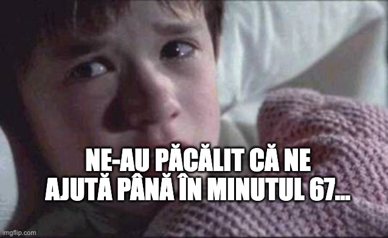

---

Pe scurt, toate deciziile pe care arbitrii le-au luat până la golul lui Petrila din minutul 67 au fost pro Dinamo. 

Și când era cazul - penalty-ul la Musi, dar mai ales când nu era cazul:

1. Armstrong nu primește galben pentru incitarea publicului după primul gol.

2. Armstrong nu e eliminat pentru atacul brutal la Vulturar. Nu mai vorbesc că dacă primea galben pentru incitarea spectatorilor, ar fi fost oricum eliminat pentru două galbene.

3. Matteo Duțu păstrează mingea în posesie cu ajutorul unui henț în faza celui de-al doilea gol marcat de Dinamo...

Niște arbitri care aveau ceva cu Dinamo foloseau aceste ocazii ca să rezolve partida, nu așteptau până la faza duelului Borza - Musi, când evident că s-au făcut de râs nesancționând faultul clar al rapidistului înainte de golul lui Petrila (min. 67)

[Aici ai un video](https://youtu.be/l-D5b8OQnR4) în care discut despre arbitrajul lui Istvan Kovacs și Cătălin Popa (VAR) de aseară, dar și despre motivele pentru care reacția celor de la Rapid a fost pe alocuri comic-penibilă:

