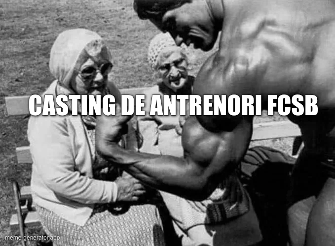

[Aici ai și varianta video a acestui text.](https://www.youtube.com/watch?v=xrwx5YeZWrs)

Au trecut ceva zile de la plecarea lui Mirel Rădoi și campioana este încă sub conducerea tehnică a lui Lucian Filip și Alin Stoica. 

Din staff mai fac parte antrenorul cu portarii, Marius Popa.

Și preparatorul fizic Horia Codorean.

De ce-i menționez pe toți?

Pentru că sunt oamenii lui Mihai Stoica și vor fi impuși noului antrenor pentru că așa se face la cluburile mari - cine vine lucrează cu asistenți oferiți de club.

Nu de alta, dar tot la cluburile mari, noul antrenor poate să dispară peste noapte, așa că e de datoria clubului să se asigure că va avea oameni pregătiți să preia munca dintre meciuri, că la meciuri își face timp patronul să rezolve problemele tehnico-tactice.

Bun, de ce nu vine încă nimeni?

Mai ales că, după spusele lui Gigi Becali, o grămadă de antrenori români s-au autopropus deja. Iar după spusele lui Mihai Stoica, o grămadă de antrenori străini au fost propuși prin intermediul impresarilor.

Mint cei doi?

Sunt absolut convins că ambii spun adevărul

Atunci?

Atunci, problema este că atât Becali, care decide într-un final, dar și Mihai Stoica vor un antrenor care să le fie comod.

Desigur, fiind vorba de oameni diferiți, fiecare are alte cerințe în ceea ce privește comoditatea.

Becali vrea pe cineva foarte bun în ceea ce privește, cum îi spune... 

Expresia aceea a lui Ilie Dumitrescu... 

Ciclul săptămânal!

Să fie atât de bun în ceea ce privește derularea ciclului săptămânal de antrenamente încât să aducă jucătorii în cea mai bună formă la ora meciului. 

Dar în același timp, suficient de umil încât să nu mârâie când patronul face primul 11 și schimbările. 

Nu e chiar ușor să găsești așa ceva pentru că cei buni în meseria lor nu prea sunt dispuși să-l lase pe Becali să se ocupe de partea sofisticată a antrenoratului.

În schimb, Mihai Stoica îmi dă impresia că vrea în același timp un antrenor cu care să dea lovitura în România - adică să-și confirme valoarea de manager, dar îl simt dornic să aducă și un pic de vedetă. 

Cineva care a jucat fotbal la nivel înalt cu care să se întovărășească și prin intermediul căruia să pipăie mental fotbalul mare din trecutul recent sau chiar din cel ceva mai îndepărtat.

Acum, dacă va accepta Charalambous, gata, se rezolvă aproape tot ce e de rezolvat, poate mai puțin satisfacția omenească a lui Mihai Stoica de-a-și aduce un viitor prieten-vedetă.

