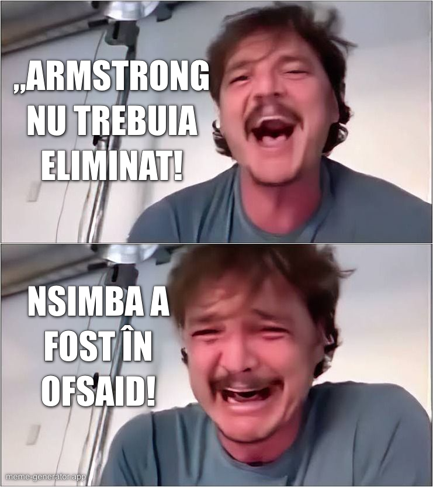

După ce Craiova a câștigat în fața lui Dinamo cu ajutorul unei uriașe gafe de arbitraj, oltenii văd întreaga situație ca pe ceva banal. 

Cam la fel cum au văzut-o și cei de la Dinamo după ce [Armstrong n-a fost eliminat]( https://www.youtube.com/watch?v=X4mu6gb27MI) în acel 2-2 de anul trecut.

În fine, am vorbit despre asta și despre ce riscă echipele care sfidează adevărul când sunt avantajate clar de arbitri.

Ai toate detaliile aici - [Dinamo și Craiova, aceeași ipocrizie](https://youtu.be/pR-Dbee6CV0)