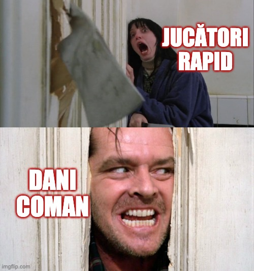
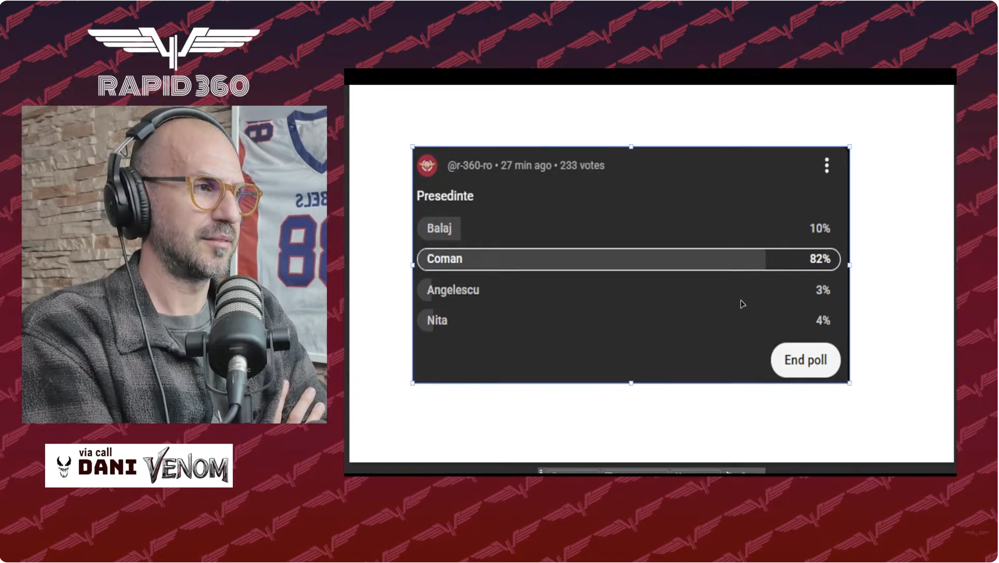

[Aici ai varianta video a ideilor din acest text.](https://youtu.be/Wtjr4NVmOlI)

Nu știu dacă ai observat, dar există un soi de fascinație a unora dintre fanii Rapidului pentru ideea de-a-l avea pe Dani Coman ca președinte al clubului.

Desigur, bănuiesc că nu e vorba despre fanii care l-au supranumit “Bani Coman” sau “Dani fii tare / Te-njurăm în continuare”, ci de cei care-l consideră pe acesta singurul capabil să câștige titlul cu echipa lor favorită.

În fine, aseară chiar am văzut pe canalul lui Daniel Marcu, [Rapid 360](https://www.youtube.com/watch?v=w1TIdg7VaG4), un sondaj care indica entuziasmul multor fani giuleșteni față de ideea venirii lui Coman.

## Argumentele lucide și mai puțin lucide pro-Coman

Acum, o parte din această simpatie intensă pentru Coman este justificată obiectiv: s-a descurcat bine la Astra, s-a descurcat bine la Sibiu și excelent la FC Argeș, unde a contribuit la promovarea echipei, dar și la intrea acesteia în play off cu un buget alimentat din bani publici, dar subțire comparativ cu al altora.

Apoi, vine credința aparent obiectivă conform căreia Dani Coman ar fi net superior lui Angelescu în postura de președinte. Doar că această credință nu ține cont de o nuanță importantă - Angelescu a avut o implicare și dincolo de partea pur sportivă.

În fine, al 3-lea element care alimentează acest entuziasm are legătură cu fascinația multor fani ai echipelor din România față de antrenorii sau conducătorii cu mână forte, care se impun printr-un așa zis factor de toughness.

Doamne, ce expresii am ajuns să folosesc din cauza lui Dani Coman!

Idee este că inclusiv presa sportivă glorifică situațiile de acest gen - cum vine cineva nou la o echipă, cum apar articole elogioase legate de cum a dat respectivul antrenor sau conducător milităria jos din pod.

Sau a bătut cu pumnul în masă.

## Farmecul de boxeur la propriu și la figurat al lui Coman

Ei, în acest context, merită remarcat că Dani Coman are real imaginea unui tip care poate bate răsunător cu acel pumn în masă.

E fost practicant de box în copilărie.

A participat la lupte ilegale impresariat de Dan Alexa pe vremea când amândoi jucau la Rocar.

A avut izbucnirea aceea violentă verbal după scandalul de la FC Petrolul - FC Argeș (2-1), când a spus că arbitrii ar trebui călcați în picioare.

Acum, după gafa lui Borța din finalul meciului U Cluj - FC Argeș (1-0) a zis că speră să nu-l vadă-n față pe jucător.

Toate aceste adunate fac din Coman un individ pe gustul celor care speră să vadă-n curtea Rapidului genul de ordine pe care o face un frate mai mare pe maidanul din spatele blocului.

## Dragostea “părintească” a unor suporteri față de jucători

De altfel, după cum știi, societatea noastră încearcă să lase în urmă ideea că dacă-ți iubești copilul, e bine să-l mai altoiești din când în când.

Să nu o ia pe căi greșite, desigur.

Ei, bănuiala mea este că unii suporteri simt această fascinație pentru Coman și pentru că-l văd capabil să-i pedepsească pe acei jucători nerușinați care nu se ridică la nivelul așteptărilor fanilor.

Să le scoată naibii fițele din cap!

De asemenea, există și un soi de invidie nemărturisită a multor fani față de fotbaliștii care deși câștigă o grămadă de bani și practică ceea ce este considerat una dintre cele mai frumoase meserii din lume, se comportă deplorabil.

Un individ precum Coman ar putea fi în opinia acestor fani exact tratamentul potrivit în astfel de cazuri. Și cum Rapidul tot speră de niște ani să conteze în campionat fără să reușească, probabil dorința de-a-l vedea mai repede pe Coman în Giulești a atins apogeul. 

