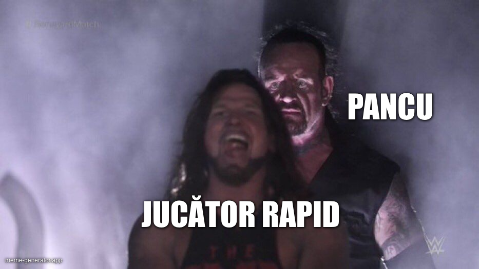

[Aici ai varianta video a unora dintre ideile din acest text.](https://www.youtube.com/watch?v=OO7VpO3M-qg)

Acum mai bine de 5 ani, am făcut un video în care spuneam că ideea celor de la Rapid de-a încerca promovarea în Liga 1 cu ajutorul lui Pancu a fost o eroare.

Și am lansat atunci o teorie pe care o repet cu orice ocazie prin emisiuni - “echipele mari numesc antrenori mari”.

Sau încearcă măcar să facă asta.

În rarele momente când aleg un antrenor fără experiență, neconsacrat, o fac pentru că văd în respectivul potențialul de-a fi un antrenor mare.

Iar ca să vadă asta, trebuie să-l cunoască în amănunt - vezi cazul numirii lui Chivu la Inter, care este efectul faptului că cei italienii îl știau foarte bine de la Primavera, iar parcursul de la Parma doar le-a conferit încredere suplimentară.

În fine, Pancu de astăzi nu mai este Pancu de atunci.

Îndrăznesc să spun că Pancu de astăzi este net mai bun și decât Pancu de acum câteva luni, când CFR Cluj l-a numit să salveze ce se poate din ceea ce părea un sezon dezastruos.

Totuși, are suficientă experiență cât să fie o soluție ideală pentru un club precum Rapid?

Îți spun imediat, după ce îți evidențiez calitățile și problemele lui Pancu.

## Atuurile lui Pancu

Pancu are câteva atuuri care-l pot ajuta să devină un nume greu în lumea antrenoratului.

În primul rând, a fost un fotbalist de clasă, care a avut ocazia să interacționeze cu niște antrenori de nivel mondial. 

Apoi, experiențele sale ca antrenor federal sunt un mare câștig pentru că a făcut o muncă specială de selecție. Din postura respectivă, a evaluat jucători, i-a comparat, i-a verificat în jocuri oficiale și a tras concluzii care îl vor însoți toată cariera sa. 

În fine, personalitatea sa este una aparte. 

De exemplu, speculez că energia sa actuală vine și din confruntarea cu un adevăr neplăcut al trecutului - Pancu a fost mult mai bun decât a reușit să demonstreze că este. Adică, a obținut prea puțin de la fotbal raportat la talentul său.

Genul acesta de experiență la pachet cu eventuale emoții legate de un eșec financiar în viața de după terminarea activității de fotbalist pot să-l facă pe Pancu să aibă o uriașă ambiție să reușească în calitate de antrenor.

Repet, speculez. 

Nu am o relație personală cu Pancu, nu am detalii legate de veniturile sale din fotbal sau alte amănunte de acest gen. Pur și simplu comenteze din exterior ce mi se pare mie că văd. 

## Defectele lui Pancu

În primul rând, există acel episod de la meciul naționalei de tineret cu Elveția. Izbucnirea sa violentă la nivel de gestică a reprezentat o lipsă de control care poate fi problematică.

Desigur, urmările și reacțiile de după acea experiență îl pot face să fie mult mai reținut pe viitor în situații tensionate, dar ca să ajungi să dai un verdict de genul “Pancu e un antrenor capabil să-și controleze trăirile” e nevoie de timp și de situații în care să demonstreze asta.

Mai mult, e posibil ca o parte din ceea ce-l face să fie bun ca antrenor să se hrănească din aceeași sursă emoțională care l-a făcut să aibă și acea izbucnire.

Și tot legat de imaginea sa, are apucătura testosteronică de-a avea poziții publice controversate sau real greșite. Ca simplă observație empirică, în general bărbații puternici fizic sau cu un nivel crescut de încredere în sine (de multe ori cele două coexistă) au tendința de-a fi dezinhibați când vor să-și exprime ideile, indiferent de natura acestor idei.

Adică, academic vorbind, au coaie să spună ce cred despre orice chiar dacă ceea ce cred este considerat pe bună dreptate penibil sau pe nebună dreptate ofensator.

Pancu e genul de individ care are astfel de ieșiri, iar într-un mediu castrat și castrator cum sunt societățile civilizate, poate fi foarte ușor “eliminat”. 

## De ce numirea sa la Rapid e o idee bună, dar nu cea mai bună

Pancu este feblețea mea, alături de Zicu, în ceea ce privește analiza de meciuri. Adică, atunci când vine într-un studio și vorbește despre meciul care urmează sau meciul care tocmai s-a încheiat, Pancu mi se pare la cel mai înalt nivel pe care l-am văzut în România.

Absolut tot ce spune este luminos din perspectiva înțelegerii pe care o capeți tu ca individ care-i urmărește spusele. 

Dar când vine vorba de postura aceasta de antrenor la un club dificil precum Rapid, teoria mea este simplă - Pancu este o alegere bună, dar nu cred că e cea mai bună dintre cele pe care și le permiteau cei de acolo.

Cred că la ora actuală, idealul pentru majoritatea echipelor cu pretenții este ori antrenor străin dintr-un fotbal serios - Spania, Portugalia, Italia, Germania și chiar din țările nodrdice, ori antrenor român super confirmat din categoria Dan Petrescu sau Iordănescu.

Desigur, unii cred că dacă Lennnon n-a fost ce trebuie sau dacă Daum a ratat la națională, antrenorii străini ar fi un pericol. 

Realitatea este că în afară de Geaninni la FC Argeș, absolut toți italienii veniți pe aici s-au descurcat mai mult decât decent. Zenga, adus de Iorgulescu, este inițiatorul celei mai mari revoluții în ceea ce privește antrenoratul din România.

În rest, croatul Kopic la Dinamo, italo-romenul Bergodi la U Cluj și portughezul Coelho la Craiova sunt alegeri care-și dovedesc valoarea. 

Pe de altă parte, Pancu chiar are potențial de mare antrenor, rămâne de văzut dacă are și capacitatea de-a rezista mental nebuniei de la Rapid. 
