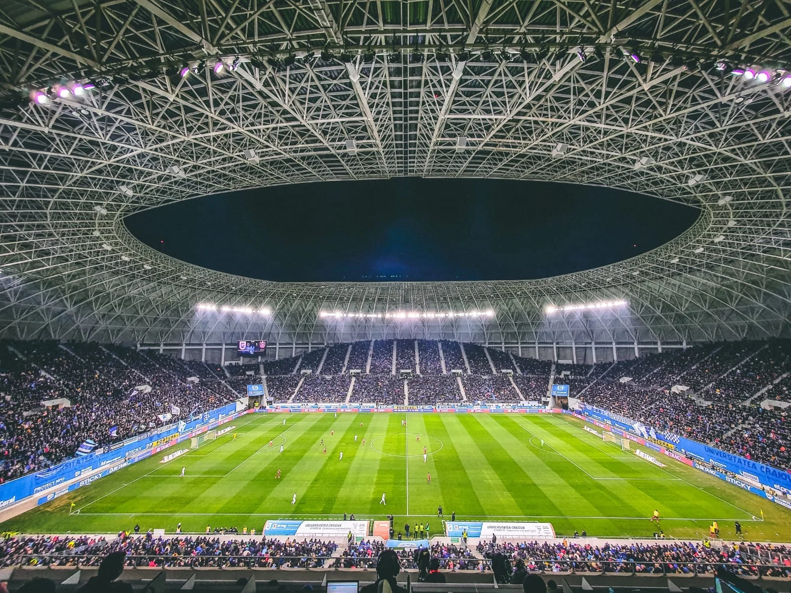

De ani buni, insist asupra unei chestiuni banale, dar importante - orice club care vrea să facă ceva în viața sa fotbalistică ar trebui să aibă ca obiectiv suprem să umple stadionul pe care joacă.

Atât.

Cine reușește asta în mod constant este un mare câștigător.

Cel mai mare posibil.

Sigur, vor fi unii care vor veni cu tot felul de obiective alternative - de la câștigarea titlului la participarea în faze superioare ale cupelor europene.

Habar n-au ce vorbesc.

Oricine îndeplinește acest obiectiv suprem despre care îți spun eu - să joace cu stadionul plin meci de meci - face automat acele lucruri necesare performanței sportive și financiare.

Un stadion serios plin presupune ceea ce e necesar să atragi oamenii la fața locului - de la promovarea de jucători din propria academie, cu care fanii se identifică mult mai ușor, și până la rezultate sportive care îi aduc în tribune inclusiv pe fanii de rezultat, totul se subordonează ideii de-a umple stadionul.

Orice mișcare toxică duce la îndepărtarea oamenilor.

Orice mișcare corectă îi atrage.

Apoi, un stadion plin este o forță uriașă de convingere a sponsorilor. 

Emoțional, impactul stadionului plin este mai mare decât un excel cu rating-uri TV strălucitoare. Nu mai vorbesc de faptul că un stadion plin crește major inclusiv spectacolul perceput de cei care văd meciurile din fața unor ecrane.

De asta, Craiova a reușit anul trecut cea mai importantă performanță a sa. 

Nu a fost vorba de titlu, a fost vorba de [oamenii pe care i-a adus în tribună](https://golazo.ro/universitatea-craiova-liga-1-spectatori-performanta-175258). 

În contextul conflictului de acolo, reușita aceasta este peste tot ce au obținut la un moment dat în justiție, peste titlul propriu-zis, peste meciurile reușite în cupele europene, peste vânzările lui Mihăilă, Mitriță și Cicâldău.

Și chiar peste profitul contabil pe care-l vor face anul acesta.

Fanii prezenți pe stadion sunt cea mai mare victorie a fotbalului.

Faptul că ei [vând acum abonamente așa cum n-au făcut-o vreodată](https://www.fanatik.ro/universitatea-craiova-a-scos-la-vanzare-abonamentele-pentru-sezonul-2026-2027-cat-costa-un-loc-pe-ion-oblemenco-dupa-eventul-reusit-de-olteni-21486404) este doar o prelungire a ceea ce au reușit anul trecut din perspectiva prezenței publicului pe stadion.

Cine înțelege că acesta e cel mai important lucru în fotbal va avea echipă. 

Fără așa ceva, ești mereu la mâna politicului sau la mâna impulsivității unui finanțator sau altul.

Craiova a dat marea sa lovitură sezonul trecut și încearcă să continue pe acest drum sezonul acesta. Habar n-am dacă ei gândesc lucrurile de maniera aceasta sau doar își setează alte obiective care adunate duc la realizarea acestui uriaș obiectiv.

Ce știu este că orice echipă ignoră obiectivul stadionului plin pierde major.

Astfel, Craiova nu trebuie imitată pentru c-a folosit AI-ul să-și evalueze transferurile sau că s-a uitat în Liga a 3-a din Franța după jucători sau pentru că a adus un portughez după Rădoi...

Craiova trebuie imitată pentru c-a reușit conștient sau nu, intenționat în totalitate sau doar parțial să facă supremul în fotbal - să-și aducă fanii și nu numai pe stadion.